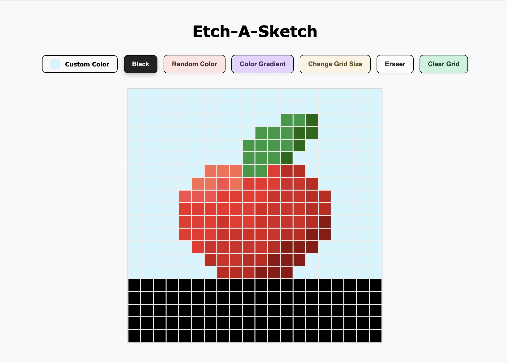

# Etch-a-Sketch

A simple browser-based Etch-a-Sketch application built using **HTML**, **CSS**, and **JavaScript**.

Users can draw on a grid by clicking and dragging their mouse. Several coloring modes are supported, including black, random colors, gradient shades, and a custom color picker. The grid can be cleared entirely or selectively using an eraser. Users can also adjust the grid size dynamically.

## Features
- Fixed-size canvas
- Click-and-drag drawing
- Color modes:
  - Black 
  - Random RGB 
  - Single Hue Gradients
  - Custom Color Picker
- Eraser
- Reset grid size (up to 100 x 100)
- Clear grid
- Responsive design
- Styled with custom colors and hover effects

## Preview

## Technologies Used
- HTML
- CSS (Flexbox)
_ Vanilla JavaScript

> _This project intentionally avoids CSS Grid to focus on mastering Flexbox._

## Future Improvements
- Add custom brush and eraser icons as cursors
- Adjustable brush/eraser size
- Enhance mobile support and touch handling
- Option to save the drawing as an image or preserve progress
- Save custom colors or maintain sketch color history

## Live Demo
*Want to create a sketch? Try it out!*
[Live Site](https://ni-ki-web.github.io/etch-a-sketch/)
